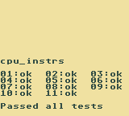
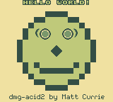
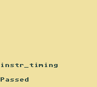
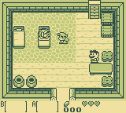
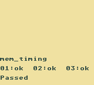
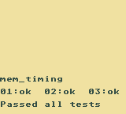
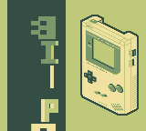
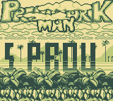

# GBPLAY

**GBPlay** is an open-source Game Boy (DMG) emulator written in C.

## 🚀 Features

- ⏱️ **CPU**: T-cycle accurate
- 🖼️ **PPU**: T-cycle accurate
- 💾 **Cartridge Types**: NoMBC, MBC1
- ⏲️ **Timers**
- ⚡ **Interrupts**
- 🔄 **DMA**
- 🎮 **JoyPad input**

### 🛠️ TODO

- 🔊 APU (Audio)
- 💾 Additional cartridge types

## 📦 Installation

### Requirements

Make sure the following dependencies are installed:

- [SDL3](https://github.com/libsdl-org/SDL)
- `make`
- `gcc`

### Build

```bash
make
```

## ▶️ Usage

```
usage: [rom]

positional arguments:
  rom          ROM path
```

### 🎮 Controls

Default key bindings:

| Key         | Action                   |
|-------------|--------------------------|
| Enter       | START                    |
| Right Shift | SELECT                   |
| Z           | B                        |
| X           | A                        |
| Up          | UP                       |
| Right       | RIGHT                    |
| Down        | DOWN                     |
| Left        | LEFT                     |

## 🖼️ Screenshots












